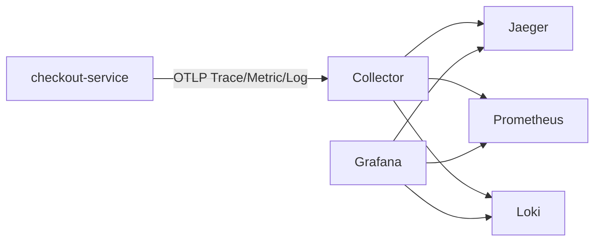

# Commit 1：初始化单服务三类遥测

## Commit 信息

- Hash：`d226a3152937826fb927564a57e071e87283d2f6`
- Subject：`init`
- 时间：2026-08-21 11:21:28 +08:00
- 父提交：无，这是根提交

## 这个 Commit 解决什么问题

从空仓库建立一个可运行的 Node.js OpenTelemetry Demo。单个 `checkout-service` 同时产生 Trace、Metric、Log，经 Collector 分别进入 Jaeger、Prometheus、Loki，并由 Grafana 统一展示。



## 主要改动

### 应用和 SDK

- 新增 `app.js`：Express `/checkout` 接口、成功/失败路径、手动业务 Span、自定义指标和关联日志。
- 新增 `instrumentation.js`：NodeSDK、自动插桩以及三种 OTLP/HTTP exporter。
- 通过 `node --require ./instrumentation.js app.js` 保证 SDK 先于 Express 加载。

### Collector 和存储

- 新增 `otel-collector-config.yaml`：Trace、Metric、Log 三条 pipeline。
- 新增 `docker-compose.yaml`：启动 Jaeger、Collector、Prometheus、Loki、Grafana。
- 新增 `prometheus.yaml`、`loki-config.yaml`。

### Grafana

- 自动预置 Prometheus、Loki、Jaeger 数据源。
- 自动预置请求总数、失败数、请求速率、P95 和应用日志 Dashboard。
- Loki Derived Field 可从日志 Trace ID 跳转 Jaeger。

## 如何运行

```bash
npm install
npm run infra:up
npm start
```

产生成功和失败请求：

```bash
curl http://localhost:3000/checkout
curl 'http://localhost:3000/checkout?fail=true'
```

## 如何测试

```bash
npm run check
docker compose config --quiet
npm run infra:status
```

手动验收：

1. Jaeger 选择 `checkout-service`，查找 `GET /checkout`。
2. Trace 中确认 `validate-cart`、`query-inventory`、`create-order`。
3. Prometheus 查询 `otel_demo_checkout_requests_total`。
4. Grafana Loki 查询 `{service_name="checkout-service"}`。
5. 点击日志中的 TraceID 跳转到 Jaeger。

## 这个 Commit 要学什么

- OpenTelemetry SDK 必须在被插桩模块之前加载。
- 自动 Span 描述 HTTP/Express 等技术调用，手动 Span 描述业务步骤。
- Collector 是处理和转发层，不是最终查询界面。
- Trace、Metric、Log 分别回答单次链路、整体趋势和具体事件。
- Loki 本身没有本项目使用的独立 UI，日志通过 Grafana 查询。

## 这个阶段还没有什么

- 没有第二个业务服务，不能体验跨进程上下文传播。
- 没有真实 Redis/MySQL 客户端 Span。
- 没有 Exemplar、告警、Baggage、尾采样实验和自动冒烟测试。
