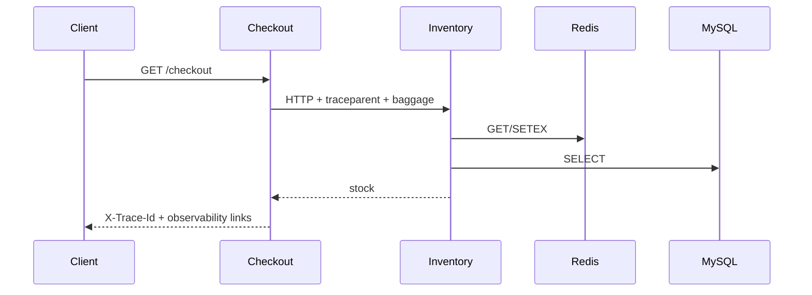

# Commit 2：跨服务采集、存储、查询和关联

## Commit 信息

- Hash：`477a32eb19bcb0c892ef175bcb24fb0fb6795583`
- Subject：`支持稍微复杂一些的数据采集、存储、查询、关联”`
- 时间：2026-08-21 14:49:55 +08:00
- 父提交：`d226a31`

## 这个 Commit 解决什么问题

把单服务演示升级为 checkout 和 inventory 两个服务，接入 Redis、MySQL，并补全 Trace、Metric、Log 的查询关联、告警和自动验证。



## 相对上一个 Commit 的主要改动

### 跨服务调用

- 新增 `inventory-service.js`，监听 3002。
- 新增 `start-services.js`，同时启动和管理两个 Node.js 进程。
- checkout 通过 HTTP 调用 inventory，自动传播 W3C Trace Context。
- Baggage 传播 `demo.cart.id`、`demo.tenant.id`。
- 响应增加 `X-Trace-Id` 和 Jaeger/Grafana/Prometheus 直达链接。

### Redis 与 MySQL

- Compose 增加 Redis、MySQL 和健康检查。
- 新增 `mysql/init.sql` 初始化库存表。
- inventory 使用真实 Redis、MySQL 客户端，产生 `redis-GET`、`redis-SETEX`、`SELECT` 自动 Span。

### 三类数据关联

- 新增 `telemetry-logger.js`，统一关联日志格式。
- 使用 OpenMetrics Histogram 和 Exemplar，把 Metric 数据点连接到 Jaeger Trace。
- Grafana Prometheus 数据源配置 Exemplar 跳转。
- Loki 日志通过 Trace ID 跳转 Jaeger。

### Collector 和告警

- 增加 `memory_limiter`、`resource`、`batch` 和 `/health` Trace 过滤。
- 增加本地时间 transform 和 `deployment.environment.name`。
- 新增 Prometheus 规则和 Grafana 托管告警。
- 新增 `docs/collector-pipeline.md` 解释 Collector 流水线。

### 自动验证和造数

- 新增 `scripts/smoke-test.sh`。
- 新增 `scripts/generate-traffic.sh`。
- `.env.example` 展示 SDK 头部采样环境变量。

## 如何运行

```bash
npm run infra:up
npm start
```

产生一条完整链路：

```bash
curl -i http://localhost:3000/checkout
```

持续造数并打印查询链接：

```bash
npm run traffic
```

## 如何测试

```bash
npm run check
docker compose config --quiet
npm run test:smoke
```

冒烟测试验证：

- 同一 Trace 包含 checkout、inventory 两个服务。
- Trace 包含 Redis、MySQL Span。
- Loki 能找到两服务关联日志和 Baggage。
- Prometheus 有有效 Exemplar。
- Prometheus/Grafana 告警规则已加载。
- `/health` Trace 不进入 Jaeger。

## 关键查询

Jaeger 中应看到：

```text
GET /checkout
├─ validate-cart
├─ HTTP inventory-service
│  └─ GET /inventory/:sku
│     ├─ redis-GET / redis-SETEX
│     └─ SELECT
└─ create-order
```

Loki 按 Trace ID 查询：

```logql
{service_name=~"checkout-service|inventory-service"} |= "TRACE_ID"
```

Prometheus 查询 P95：

```promql
histogram_quantile(
  0.95,
  sum by (le) (rate(checkout_request_duration_seconds_bucket[5m]))
) * 1000
```

## 这个 Commit 要学什么

- 分布式 Trace 依赖 `traceparent` 跨进程传播，而不是两个服务独立生成相同 ID。
- Baggage 传播业务上下文，但不能作为高基数 Metric 标签滥用。
- 自动插桩可覆盖 HTTP、Redis、MySQL，业务阶段仍需要手动 Span。
- Exemplar 是 Metric 到代表性 Trace 的抽样桥梁，不保证每次请求都有永久映射。
- Collector processor 的顺序会影响最终导出数据。

## 这个阶段还没有什么

- 只有普通成功和单一业务失败，不能系统练习 DB、Redis、慢请求排障。
- 正常 Trace 仍基本全量保留，没有智能尾采样实验。
- 没有 RabbitMQ 或 payment-service。
